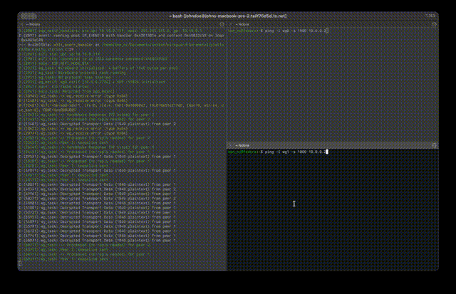

# Seikan: Formally Verified WireGuard for Bare-Metal Systems

The protocol core is written in Ada/SPARK and validated to SPARK's
[Gold level](https://docs.adacore.com/live/wave/spark2014/html/spark2014_ug/en/usage_scenarios.html#levels-of-software-assurance).
The core does not allocate any heap memory and instead uses static memory pools
for deterministic runtime and low memory footprint.
The Ada code is designed to be portable, but the platform layer uses the ESP-IDF
framework with FreeRTOS.

The tunnel packets are WireGuard-compatible wire format which achieves
interoperable with the standard Linux `wg0` kernel interface.
The ESP32 appears as a normal WireGuard peer to any Linux, macOS, or Windows
endpoint.



## Code Architecture

```
Ada/SPARK  (proven, no heap)              C / ESP-IDF  (unverified I/O)
┌────────────────────────────────────┐    ┌──────────────────────────┐
│  Protocol state machine            │    │  WiFi STA driver         │
│  Noise IKpsk2 handshake            │    │  lwIP netif (wg0)        │
│  Transport encrypt / decrypt       │    │  UDP socket (port 51820) │
│  Session timers & key rotation     │    │  Monotonic clock         │
│  Replay window (sliding bitmap)    │    │  NVS / flash storage     │
│  Static buffer pool + ring buffer  │    └─────────────┬────────────┘
└──────────────┬─────────────────────┘                  │
               │                                        │
               └────────────── C ABI ───────────────────┘
```

**Design rules:**

- Ada owns all protocol state: C never interprets WireGuard semantics
- C is an untrusted I/O layer: Ada validates every byte
- Zero-copy RX: C provides a buffer pointer, Ada decrypts in-place, Ada returns
the buffer
- Zero-copy TX: Ada borrows a buffer from the pool, encrypts in place, C
transmits and returns it

## Wireguard Network Interface

The tunnel uses a **split architecture** built on lwIP's `netif` API to create a
pseudo network interface (`wg0`) that the ESP32's TCP/IP stack routes through
transparently.
Application code never touches WireGuard directly. It uses standard BSD sockets
pointed at tunnel IP addresses, and lwIP handles the rest.

```
                    Application (BSD sockets)
                           │
                      ┌────▼────┐
                      │  lwIP   │  ← IP routing table
                      └────┬────┘
                  ┌────────┴─────────┐
                  │                  │
            ┌─────▼─────┐     ┌──────▼─────┐
            │  sta netif │    │  wg0 netif │  ← WireGuard tunnel
            │  (WiFi)    │    │  10.0.0.2  │
            └────────────┘    └─────┬──────┘
                                    │  output callback
                              ┌─────▼──────┐
                              │  wg_task   │  ← encrypts/decrypts
                              └─────┬──────┘
                                    │  UDP :51820
                              ┌─────▼──────┐
                              │  sta netif │  ← outer transport
                              └────────────┘
```

**Outer side**: A UDP PCB bound to port 51820 receives encrypted WireGuard
datagrams from the WiFi interface. Incoming packets are copied into RX pool
buffers and enqueued to `wg_task`, which hands them to Ada for decryption.
Decrypted plaintext is injected back into lwIP via `tcpip_input()` as if it
arrived on the `wg0` interface.

**Inner side**: When lwIP routes an outbound IP packet to `wg0`, the netif
output callback copies the plaintext into a TX pool buffer (with 16 bytes of
headroom for the WireGuard transport header), then enqueues it to `wg_task`.
Ada encrypts in-place and the ciphertext is sent over UDP through the WiFi
interface.

Both directions use `pbuf_custom` / `PBUF_REF` wrappers for zero-copy
handoff between pool buffers and lwIP, no extra memcpy on the hot path.

### Using the Tunnel

Once the handshake completes, application code on the ESP32 can communicate
through the tunnel using ordinary BSD sockets. The tunnel peer's IP is routed
through `wg0` automatically by lwIP:

```c
#include <lwip/sockets.h>

// Open a UDP socket — nothing WireGuard-specific
int sock = socket(AF_INET, SOCK_DGRAM, IPPROTO_UDP);

// Send to the tunnel peer's IP (routed through wg0 by lwIP)
struct sockaddr_in dest = {
    .sin_family      = AF_INET,
    .sin_port        = htons(9999),
    .sin_addr.s_addr = inet_addr("10.0.0.1"),  // peer's tunnel IP
};

sendto(sock, "hello", 5, 0,
       (struct sockaddr *)&dest, sizeof(dest));

// Receive works the same way
char buf[256];
recvfrom(sock, buf, sizeof(buf), 0, NULL, NULL);

close(sock);
```

The application has no awareness of WireGuard. lwIP's routing table sends
`10.0.0.0/24` traffic through `wg0`, whose output callback encrypts it and
transmits over WiFi. Incoming encrypted packets are decrypted and injected into
lwIP, appearing as normal IP traffic on `wg0`.

> [!NOTE]
> If `wg_task` receives an outbound packet for a peer that has no active session,
> it initiates a handshake automatically, establishes the tunnel, and then
> encrypts the queued packet. Rekeys are also automatic when a session
> approaches expiry.

## Dependencies

- [Alire](https://alire.ada.dev/) 2.x — Ada package manager
  - Installs GNAT toolchain for RISC-V (`gnat_risc64_elf`)
  - Installs SPARK prover
- [ESP-IDF](https://docs.espressif.com/projects/esp-idf/) v6.x
- [Podman](https://podman.io/) or [Docker](https://www.docker.com/) (optional,
  for reproducible container builds)

## Building

All builds go through `build.py`, which first compiles the Ada crate with Alire,
then runs `idf.py` to build the ESP-IDF firmware and link the Ada static
libraries.

### Quick Start

> [!NOTE]
> Run `git submodule update --init --recursive` before building for the first time

```bash
# Generate test keys (first time only)
python build.py keygen

# Release build (optimised, no runtime checks) — default
python build.py build

# Development build (runtime checks, debug logs, ghost assertions)
python build.py build --development

# Build and flash to device
python build.py build --idf flash

# Build, flash, and open serial monitor
python build.py build --idf flash monitor

# Clean everything (Ada + ESP-IDF)
python build.py clean

# Can aggregate multiple flags together
python build.py clean build --development --idf flash monitor
```

### Container Build (Reproducible)

Use `--container` to build inside an OCI container with all toolchains pinned.
Requires [Podman](https://podman.io/) or Docker — the image is built
automatically on first run.

```bash
# Release build in container
python build.py build --container

# Development build in container
python build.py build --container --development

# Clean + rebuild in container
python build.py clean build --container
```

> [!NOTE]
> The `--idf flash` and `--idf monitor` flags require USB device access and
> should be run outside the container.

> [!Warning]
> The default target is **ESP32-C6** (RISC-V). To build the container image for
> a different chip, pass `IDF_TARGET` as a build arg:
> ```bash
> podman build --build-arg IDF_TARGET=esp32s3 -t veriguard-build -f Containerfile .
> ```
> You will also need to update `CONFIG_IDF_TARGET` in `sdkconfig.defaults` to
> match.

### Build Profiles

| Profile | Ada Optimisation | Runtime Checks | Ghost Assertions | C Debug |
|---------|-----------------|----------------|------------------|---------|
| `--release` (default) | `-Os` | None | Disabled | Assertions off, `-Os` |
| `--development` | `-O0` | Everything | `Pre => Check` | Core dump to UART, GDB stub, `DEBUG` log level |

> [!NOTE]
> Postconditions are verified statically only (`Post => Ignore`). Runtime
> postcondition checks are disabled because the `Free_Count` ghost function
> reads pool state without the pool lock, and concurrent C allocations can
> change it between function entry and exit


### Configuration

Device-specific secrets (WiFi credentials, WireGuard keys) live in
`sdkconfig.secrets`. Copy the template to get started:

```bash
cp sdkconfig.secrets.example sdkconfig.secrets
```

Then edit `sdkconfig.secrets` with your values, or use `idf.py menuconfig` to
configure interactively. The Kconfig menu provides:

- **WiFi Configuration** — SSID and password
- **WireGuard → Keys** — ESP32's X25519 private key
- **WireGuard → Peer 1 / Peer 2** — remote public key, optional pre-shared key,
  allowed IP + prefix, persistent keepalive interval

Up to 2 peers are supported. `build.py keygen` generates matching keypairs
for the ESP32 and Python test side, writing `sdkconfig.secrets` and
`tests/integration/test_keys.py` automatically.

Keys can be extracted to create a wireguard network interface for testing as
well.
```bash
# Create a new interface
$ ip link add dev wg0 type wireguard

# Assign tunnel IP address
$ ip address add dev wg0 10.0.0.1/32

# Save interface private key to a file
$ echo <interface private key> > /tmp/wg_priv

# Configure keys and peer endpoint
$ sudo wg set wg0 \
    private-key /tmp/wg_priv \
    listen-port 51820 \
    peer <esp326c wireguard public key> \
    allowed-ips 10.0.0.2/32 \
    endpoint 10.10.0.117:51820

# Activate interface
$ ip link set up dev wg0

# Show curent configuration
$ wg

# Test connection
$ ping 10.0.0.2
```

## Running SPARK Proofs

The protocol core is proven at **gold level** (full functional correctness):

```bash
cd wireguard
alr exec -- gnatprove -P wireguard.gpr --mode=gold --timeout=5 -j8 \
  -XPLATFORM=esp_idf -XCRYPTO_BACKEND=libsodium
```

Gold level verifies:
- Absence of runtime errors (overflow, range, index)
- Data flow correctness (no uninitialised reads)
- All preconditions, postconditions, and loop invariants
- Termination

## Running Tests

### Integration Tests (Hardware-in-the-Loop)

The integration tests use `pytest-embedded-idf` and require an ESP32-C6 connected
via USB. Each test module has two layers: pure Python self-tests that validate the
reference implementation, and ESP32 integration tests that exercise the firmware.

```bash
# Run all integration tests
pytest

# Run a specific test module
pytest tests/integration/pytest_handshake.py

# Run only the Python-side self-tests (no hardware needed)
pytest -m "not esp32c6"

# Run only ESP32c6 hardware in the loop tests
pytest -m "esp32c6"

# Verbose output
pytest -s -v
```

**Test modules:**

| Module | What it tests |
|--------|---------------|
| `pytest_veriguard.py` | Startup: WiFi connect → netif init → Ada init → task start |
| `pytest_handshake.py` | Noise IKpsk2 handshake between Python and ESP32 |
| `pytest_session.py` | Session timer state machine, key rotation, slot expiry |
| `pytest_transport.py` | Type 4 transport packet encrypt/decrypt round-trip |
| `pytest_cookie.py` | Cookie mechanism (§5.4.7): XChaCha20-Poly1305, MAC2, replay protection |
| `pytest_auto_handshake.py` | Auto-handshake rate limiting, in-flight detection |

The tests use two Python reference implementations as oracles:
- `wg_noise.py` — full Noise IKpsk2 handshake + transport packet construction
- `wg_session.py` — session timer model mirroring the Ada `Session.Timers`
package

## Performance

Measured over WiFi on an ESP32-C6, flood-pinging with 1000-byte ICMP payloads
from a Linux host through a standard WireGuard tunnel (`wg0`):

| Scenario | Avg Latency | Throughput | Packet Loss |
|----------|-------------|------------|-------------|
| 1 peer | 2.528 ms | 1.86 Mbps | 0.05% |
| 2 peers (simultaneous) | 2.718 ms | 1.54 Mbps | 0.06% |

## Crypto Backends

> [!CAUTION]
> Work In Progress

Two cryptographic backends are supported, selectable at build time via the
`CRYPTO_BACKEND` variable in the GPR files:

| Backend | AEAD | Key Exchange | Wire Format | Status |
|---------|------|--------------|-------------|--------|
| **libsodium** | ChaCha20-Poly1305 | X25519 | Standard WireGuard | ✅ Full support (default) |
| **libhydrogen** | Gimli secretbox | Gimli-based | VeriGuard-specific | ⚠️ Not WireGuard-compatible |

The backend selection also switches the wire format: libsodium uses the standard
WireGuard message layout, while libhydrogen uses a different structure that is
not interoperable with standard WireGuard peers.

## References

- [WireGuard Protocol](https://www.wireguard.com/protocol/)
- [Noise Protocol Framework](https://noiseprotocol.org/)
- [SPARK User's Guide](https://docs.adacore.com/spark2014-docs/html/ug/)
